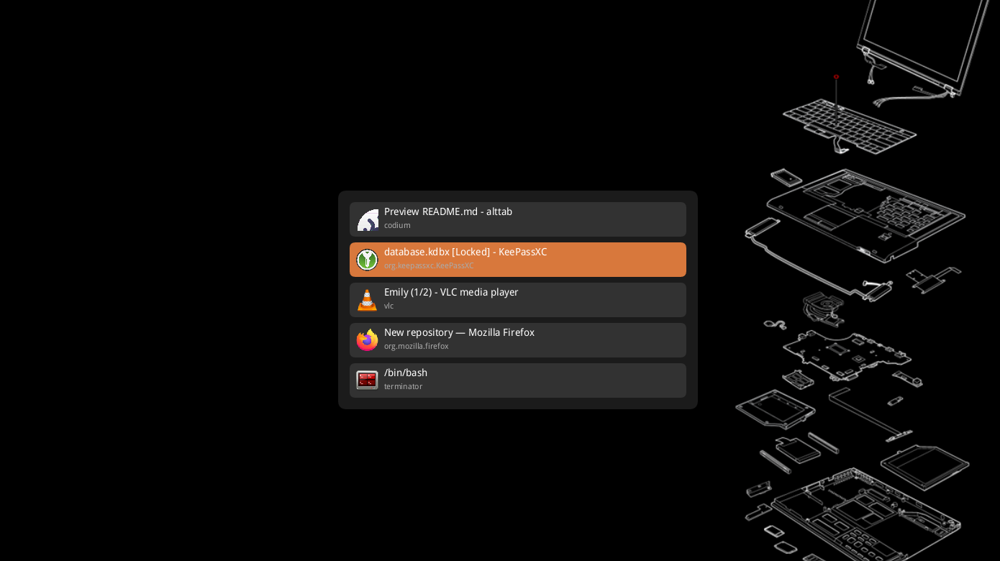

# alttab

A fast alt-tab window switcher for Wayland compositors (targeting Sway). Behaves like Windows/macOS alt-tab: a small overlay lists open windows sorted by most-recently-used order, hold Alt and press Tab to cycle, release Alt to switch.

Single Rust binary, ~2.8MB stripped. Zero runtime dependencies beyond Wayland.

> **Disclaimer**: This application was fully generated by AI (Claude). The entire codebase — architecture, implementation, and documentation — was produced through AI-assisted development.



## Features

- **MRU window switching** — Windows sorted by most-recently-used order, not workspace order
- **Daemon architecture** — Long-lived process tracks focus changes over time for accurate MRU history
- **Multi-monitor aware** — Overlay appears on the same monitor as the focused window
- **Window icons** — Loads PNG icons from desktop files and icon themes (hicolor)
- **Configurable** — Colors and layout customizable via TOML config file
- **Proper font rendering** — Embedded DroidSans TTF font rendered with fontdue (supports full Unicode)
- **Fast** — Software rendering with tiny-skia, no heavy GUI toolkit dependencies
- **Lightweight** — ~2.8MB stripped, single binary with embedded font

## Requirements

- Sway (or any wlroots-based Wayland compositor with `wlr-foreign-toplevel-management` and `wlr-layer-shell` support)
- `libxkbcommon` and `wayland` client libraries (runtime)

### Build dependencies

Building from source (including `cargo install`) requires development headers for `libxkbcommon` and `wayland`:

**Fedora:**

```sh
sudo dnf install libxkbcommon-devel wayland-devel
```

**Debian/Ubuntu:**

```sh
sudo apt install libxkbcommon-dev libwayland-dev
```

**Arch Linux:**

```sh
sudo pacman -S libxkbcommon wayland
```

## Install

### From crates.io

```sh
cargo install alttab
```

### From source

```sh
git clone https://github.com/e-gautier/alttab.git
cd alttab
cargo build --release
# Binary is at target/release/alttab
```

## Usage

### 1. Start the daemon

```sh
alttab &
```

This starts a background daemon that connects to Wayland and continuously tracks window focus changes to build MRU history.

### 2. Configure Sway keybinding

Add to `~/.config/sway/config`:

```
bindsym Alt+Tab exec /path/to/alttab --show
```

Now press Alt+Tab to bring up the switcher. Keep holding Alt and press Tab to cycle through windows. Release Alt to switch to the selected window.

### Keyboard shortcuts

| Key | Action |
|---|---|
| Tab / Down / Right | Select next window |
| Shift+Tab / Up / Left | Select previous window |
| Enter | Confirm and switch |
| Escape | Cancel |
| Release Alt | Confirm and switch |

## Configuration

Config file: `~/.config/alttab/config.toml`

All fields are optional — missing fields use sensible defaults.

```toml
[colors]
background = "#1E1E1EE6"
item = "#323232FF"
selected = "#3C78D8FF"
title = "#FFFFFFFF"
app_id = "#AAAAAAFF"

[layout]
width = 500
max_height = 600
item_height = 48
item_spacing = 8
padding = 16
corner_radius = 12.0
item_corner_radius = 8.0
```

### Colors

Hex format: `#RRGGBB` (opaque) or `#RRGGBBAA` (with alpha).

| Field | Description | Default |
|---|---|---|
| `background` | Overlay background | `#1E1E1EE6` (dark, semi-transparent) |
| `item` | Unselected item background | `#323232FF` |
| `selected` | Selected item highlight | `#3C78D8FF` (blue) |
| `title` | Window title text | `#FFFFFFFF` (white) |
| `app_id` | App ID text below title | `#AAAAAAFF` (gray) |

### Layout

| Field | Description | Default |
|---|---|---|
| `width` | Overlay width in pixels | 500 |
| `max_height` | Maximum overlay height | 600 |
| `item_height` | Height of each window entry | 48 |
| `item_spacing` | Space between entries | 8 |
| `padding` | Inner padding | 16 |
| `corner_radius` | Overlay corner radius | 12.0 |
| `item_corner_radius` | Item corner radius | 8.0 |

## Themes

Copy any of these `[colors]` sections into your `~/.config/alttab/config.toml`.

### Default (Dark)

The built-in theme. Dark background with a blue selection highlight.

```toml
[colors]
background = "#1E1E1EE6"
item = "#323232FF"
selected = "#3C78D8FF"
title = "#FFFFFFFF"
app_id = "#AAAAAAFF"
```

### Nord

Inspired by the [Nord](https://www.nordtheme.com/) color palette. Cool, arctic tones.

```toml
[colors]
background = "#2E3440E6"
item = "#3B4252FF"
selected = "#5E81ACFF"
title = "#ECEFF4FF"
app_id = "#D8DEE9AA"
```

### Catppuccin Mocha

Inspired by [Catppuccin](https://catppuccin.com/) Mocha. Warm pastel tones on a dark base.

```toml
[colors]
background = "#1E1E2EE6"
item = "#313244FF"
selected = "#89B4FAFF"
title = "#CDD6F4FF"
app_id = "#A6ADC8AA"
```

### Gruvbox Dark

Inspired by [Gruvbox](https://github.com/morhetz/gruvbox). Retro, warm, earthy tones.

```toml
[colors]
background = "#282828E6"
item = "#3C3836FF"
selected = "#D65D0EFF"
title = "#EBDBB2FF"
app_id = "#A89984AA"
```

### Dracula

Inspired by [Dracula](https://draculatheme.com/). Purple-accented dark theme.

```toml
[colors]
background = "#282A36E6"
item = "#44475AFF"
selected = "#BD93F9FF"
title = "#F8F8F2FF"
app_id = "#6272A4FF"
```

### Solarized Dark

Inspired by [Solarized](https://ethanschoonover.com/solarized/). Precision-engineered color scheme.

```toml
[colors]
background = "#002B36E6"
item = "#073642FF"
selected = "#268BD2FF"
title = "#FDF6E3FF"
app_id = "#839496AA"
```

### Tokyo Night

Inspired by [Tokyo Night](https://github.com/enkia/tokyo-night-vscode-theme). Muted blues and purples.

```toml
[colors]
background = "#1A1B26E6"
item = "#24283BFF"
selected = "#7AA2F7FF"
title = "#C0CAF5FF"
app_id = "#565F89FF"
```

### Rosé Pine

Inspired by [Rosé Pine](https://rosepinetheme.com/). Muted, elegant tones.

```toml
[colors]
background = "#191724E6"
item = "#1F1D2EFF"
selected = "#C4A7E7FF"
title = "#E0DEF4FF"
app_id = "#908CAAAA"
```

### Kanagawa

Inspired by [Kanagawa](https://github.com/rebelot/kanagawa.nvim). Japanese ink painting aesthetic.

```toml
[colors]
background = "#1F1F28E6"
item = "#2A2A37FF"
selected = "#7E9CD8FF"
title = "#DCD7BAFF"
app_id = "#727169AA"
```

### Monochrome

Minimal grayscale. No color distractions.

```toml
[colors]
background = "#181818E6"
item = "#282828FF"
selected = "#585858FF"
title = "#E8E8E8FF"
app_id = "#888888AA"
```

## How it works

The `wlr-foreign-toplevel-management` Wayland protocol only reports current window state at connection time — it has no historical activation order. A fresh process on each Alt+Tab would see all windows but wouldn't know which was used most recently.

To solve this, `alttab` runs as a daemon that stays alive and watches activation state transitions over time, building real MRU history. When triggered via `alttab --show`, the daemon creates a layer-shell overlay with exclusive keyboard grab and renders the window list using software rendering into shared memory buffers.

## Known limitations

- **PNG icons only** — SVG/scalable icons are not supported
- **Nearest-neighbor icon scaling** — Fast but not the highest quality
- **Sway/wlroots only** — Requires `wlr-foreign-toplevel-management` and `wlr-layer-shell` protocols (not available on GNOME/KDE Wayland)

## License

MIT — see [LICENSE](LICENSE).

The embedded [DroidSans](https://www.droidfonts.com/) font is licensed under the Apache License 2.0 (Copyright 2008 The Android Open Source Project) — see [fonts/LICENSE-DroidSans](fonts/LICENSE-DroidSans).
